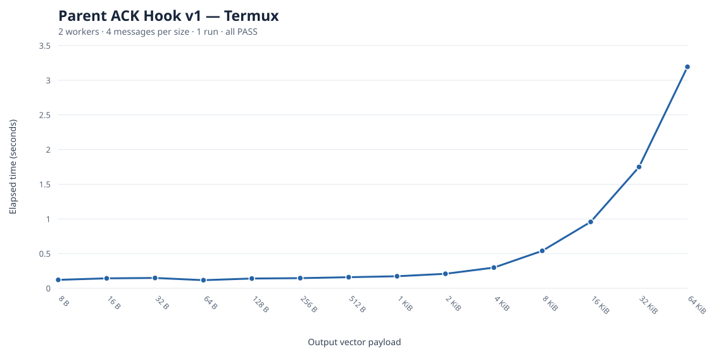

# Parent ACK Hook v1 — Termux integration benchmark



**Environment:** Termux, two persistent workers, four messages per payload size, one repetition, `DALO_ASYNC_SENDER=1`, `DALO_OUTPUT_QUEUE_ENABLED=1`. This is the parent output-vector completion-hook integration test, not a throughput benchmark for the full application.

**Result:** all 14 configurations passed, and the parent completion hook observed **56 of 56** complete vectors. Compilation: **4.465755 s**; initialization: **9.225060 s**. The largest payload (65,536 B) took **3.192619 s** for four messages.

| Payload | Elapsed (s) | Result |
|---:|---:|:---:|
| 8 B | 0.121355 | PASS |
| 16 B | 0.143027 | PASS |
| 32 B | 0.148342 | PASS |
| 64 B | 0.116806 | PASS |
| 128 B | 0.140750 | PASS |
| 256 B | 0.145541 | PASS |
| 512 B | 0.159068 | PASS |
| 1 KiB | 0.173503 | PASS |
| 2 KiB | 0.208973 | PASS |
| 4 KiB | 0.298140 | PASS |
| 8 KiB | 0.539751 | PASS |
| 16 KiB | 0.957196 | PASS |
| 32 KiB | 1.749218 | PASS |
| 64 KiB | 3.192619 | PASS |

## Reproduction

```bash
DALO_ASYNC_SENDER=1 DALO_OUTPUT_QUEUE_ENABLED=1 \
DALO_REUSE_WORKERS=2 DALO_REUSE_MESSAGES=4 \
DALO_REUSE_SIZES="8 16 32 64 128 256 512 1024 2048 4096 8192 16384 32768 65536" \
DALO_REUSE_REPEATS=1 timeout 60 bash tests/test-parent-output-ack.sh
```

**Interpretation:** the hook correctly reported complete vectors for both direct and fragmented output. This test does **not** establish delivery of ACK to the sender, release of credits, or a statistically reliable performance improvement. Timings are from one user-reported Termux run and may vary with device load. Raw values are in [`parent-ack-termux.csv`](parent-ack-termux.csv).
